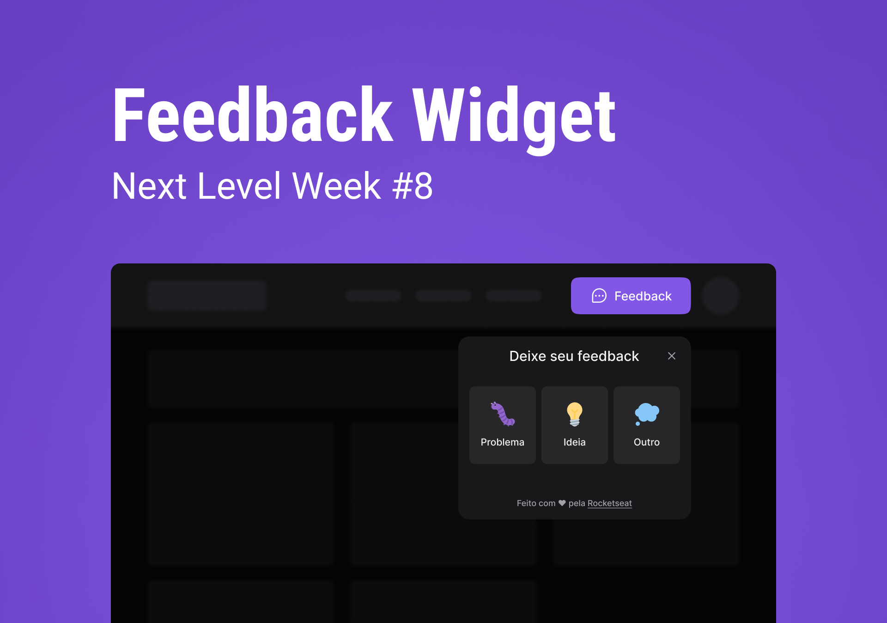

<h1 align="center">
    
</h1>

<h4 align="center">
  Next Level Week Return | Impulse Path
</h4>

  <a href="#rocket-tecnologias">Technologies</a>&nbsp;&nbsp;&nbsp;|&nbsp;&nbsp;&nbsp;
  <a href="#-projeto">Project</a>&nbsp;&nbsp;&nbsp;|&nbsp;&nbsp;&nbsp;
  <a href="#-layout">Layout</a>&nbsp;&nbsp;&nbsp;|&nbsp;&nbsp;&nbsp;
  <a href="#-como-contribuir">How to Contribute</a>&nbsp;&nbsp;&nbsp;|&nbsp;&nbsp;&nbsp;
  <a href="#memo-licença">License</a>

## 💻 Project

Feedget is Feedback Widget developed during the Next Level Week by Rocketseat.  
Available for Web and Mobile applications, Feedget collects feedbacks and storage them into a PostgreSQL database. 
The Web Application was developed with React, Tailwind CSS and deployed using Vercel.  
Mobile App was coded using React Native and the backend server was build using Node and deployed usind Railway. 

## :rocket: Technologies

Feedget was developed using these following technologies:

- [React](https://devdocs.io/react/)
- [React Native](https://devdocs.io/react_native/)
- [TypeScript](https://devdocs.io/typescript/)
- [Tailwind CSS](https://devdocs.io/tailwindcss/)
- [Node.js](https://devdocs.io/node/)
- [Prisma](https://www.prisma.io/docs/)
- [Postgresql](https://devdocs.io/postgresql/)
- [Vercel](https://vercel.com/docs)
- [Railway](https://docs.railway.app/)

## 🔖 Layout

You could visit the project layout through this [link](https://www.figma.com/file/RqCCivTRsLhrp4egZ2qCjA/Feedback-Widget-(Community)?node-id=142%3A1270). Remembering that you need to create a [Figma's account](http://figma.com/) to access the layout.

## 🤔 How To Contribute

- Fork this repository;
- Create a branch with your feature: `git checkout -b my-feature`;
- Commit your changes: `git commit -m 'feat: My new feature'`;
- Push to your branch: `git push origin my-feature`.

After your pull request is merged, you can delete your branch.

## :memo: License

This project is under the MIT license. See the [LICENSE](LICENSE.md) file for more details.

---

Made with ♥ by @ghiberti85 | Inspired by Rocketseat

